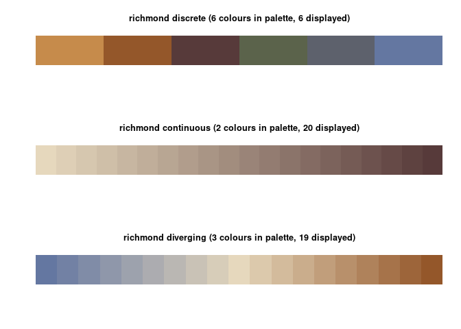
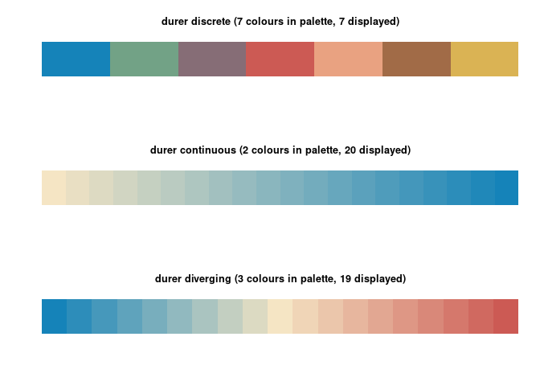

# watercolours

This package contains palettes derived from watercolour artists
including X and Y.

``` r
library(watercolours)
```

## Examples

``` r
library(ggplot2)
ggplot(diamonds, aes(color, fill = clarity)) +
  geom_bar() +
  scale_fill_watercolour(palette = "durer")
```

<!-- -->

``` r
ggplot(mtcars, aes(disp, mpg, col = qsec)) +
  geom_point(size = 4) +
  scale_color_watercolour(type = "continuous")
```

<!-- -->

The available palettes are

Anders Zorn - Sommarnöje (1886)

``` r
show_palette("zorn")
```

<!-- -->

Fidelia Bridges - Calla Lilly (1875)

``` r
show_palette("bridges")
```

<!-- -->

Dolla Richmond -[*Mount
Egmont*](https://artsandculture.google.com/asset/mount-egmont/2AH3LhLcXldhDA)

``` r
show_palette("richmond")
```

<!-- -->

Albrecht Durer - Wing of a Blue Roller

``` r
show_palette("durer")
```

<!-- -->

## Installation

You can install `watercolours` from github with:

``` r
devtools::install_github("gjcooper/watercolours")
```
