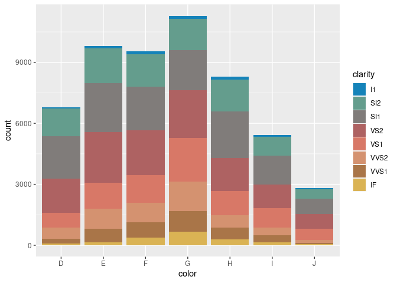
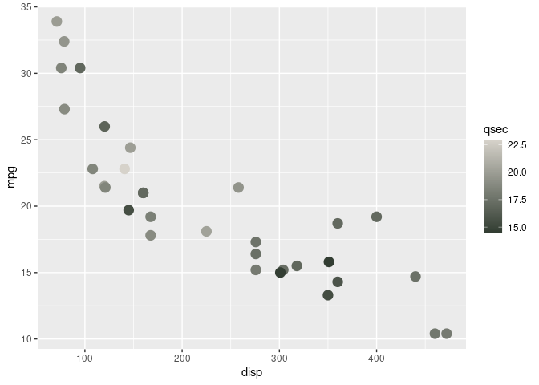
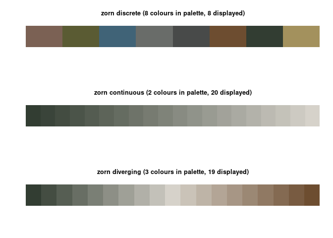
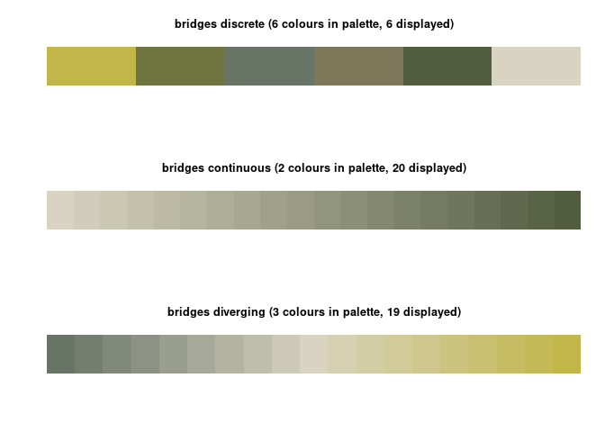

# watercolours

This package contains palettes derived from watercolour artists
including X and Y.

``` r
library(watercolours)
watercolours$frankwebb
```

    ##      roof     tree1     tree2      sky1      sky2 
    ## "#5B332B" "#D0781C" "#73842E" "#51B4B9" "#013781"

## Examples

``` r
library(ggplot2)
ggplot(diamonds, aes(color, fill = clarity)) +
  geom_bar() +
  scale_fill_watercolours(palette = "dollarichmond")
```

<!-- -->

``` r
ggplot(mtcars, aes(disp, mpg, col = qsec)) +
  geom_point(size = 4) +
  scale_color_watercolours(discrete = FALSE)
```

<!-- -->

The available palettes are

Frank Webb - Unknown painting

``` r
viz_palette(watercolours$frankwebb)
```

<!-- -->

Dolla Richmond -[*Mount
Egmont*](https://artsandculture.google.com/asset/mount-egmont/2AH3LhLcXldhDA)

``` r
viz_palette(watercolours$dollarichmond)
```

<!-- -->

## Installation

You can install `watercolours` from github with:

``` r
devtools::install_github("gjcooper/watercolours")
```
